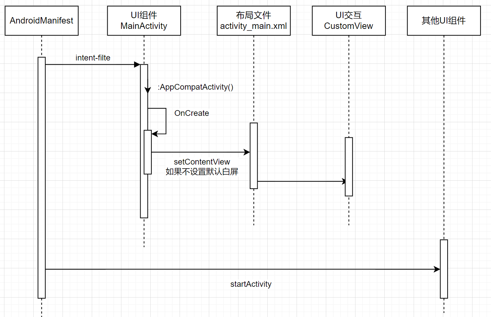

# 前言

在 Android 开发中，`XML` 和 `Compose` 是两种主要的布局和 UI 构建方式。

#  **XML（传统方式）**

XML（Extensible Markup Language）在 Android 中主要用于描述 UI 布局。它是一种声明式语言，用于定义界面元素的结构和样式。

## 特点

- **布局文件**：在 Android 中，UI 元素通常通过 `.xml` 文件来定义。例如，按钮、文本框、图片等 UI 元素都是通过 XML 标签进行声明的。
- **静态性**：XML 布局通常是静态的，布局的结构在编译时确定。在运行时你可以通过代码来动态修改布局中的某些属性。
- **布局管理器**：你需要使用不同的布局管理器（如 `LinearLayout`、`RelativeLayout`、`ConstraintLayout`）来控制界面元素的排列。
- **分离关注点**：XML 布局文件将 UI 定义与应用逻辑代码分开，有助于代码的维护和可读性。



## 代码示例

```kotlin
class MainActivity : AppCompatActivity() {
    override fun onCreate(savedInstanceState: Bundle?) {
        super.onCreate(savedInstanceState)
        setContentView(R.layout.activity_main)

        val textView: TextView = findViewById(R.id.textView)
        val button: Button = findViewById(R.id.button)

        button.setOnClickListener {
            textView.text = "Text Changed!"
        }
    }
}
```

```xml
<?xml version="1.0" encoding="utf-8"?>
<LinearLayout xmlns:android="http://schemas.android.com/apk/res/android"
    android:layout_width="match_parent"
    android:layout_height="match_parent"
    android:orientation="vertical"
    android:gravity="center"
    android:padding="16dp">

    <!-- 自定义View -->
    <com.example.app.MyCustomView
        android:id="@+id/myCustomView"
        android:layout_width="200dp"
        android:layout_height="200dp"
        android:layout_marginBottom="16dp" />

    <TextView
        android:id="@+id/textView"
        android:layout_width="wrap_content"
        android:layout_height="wrap_content"
        android:text="Hello, World!"
        android:textSize="18sp"
        android:layout_marginBottom="16dp" />

    <Button
        android:id="@+id/button"
        android:layout_width="wrap_content"
        android:layout_height="wrap_content"
        android:text="Change Text" />
</LinearLayout>
```

```kotlin
class MyCustomView(context: Context, attrs: AttributeSet? = null) : View(context, attrs) {
    private val paint = Paint().apply {
        color = Color.BLUE
        style = Paint.Style.FILL
    }

    override fun onDraw(canvas: Canvas) {
        super.onDraw(canvas)
        // 绘制一个圆形
        canvas.drawCircle(width / 2f, height / 2f, 100f, paint)
    }
}
```

# **Jetpack Compose（现代方式）**

Jetpack Compose 是 Android 推出的全新声明式 UI 库，它采用了完全不同的方式来构建界面。Compose 的核心思想是“以代码构建界面”，不再需要编写 XML 布局文件。

## 特点

- **声明式 UI**：在 Compose 中，UI 是通过函数式编程的方式定义的，所有界面元素都在 Kotlin 代码中创建和管理。这意味着 UI 和业务逻辑之间的界限变得更加模糊，代码更加简洁。
- **实时更新**：Compose 的一个重要特性是它能够自动响应数据的变化，UI 会自动更新。只要某个状态发生变化，相关的 UI 元素就会自动重新渲染。
- **灵活性**：Compose 允许你以非常灵活的方式控制 UI，可以方便地实现复杂的交互逻辑。
- **无布局管理器**：Compose 不需要布局管理器。所有 UI 元素都是通过层叠（Stack）、排列（Row、Column）和约束（Box）等方式组合的。

## 代码示例

```kotlin
@Composable
fun MainScreen() {
    var text by remember { mutableStateOf("Hello, World!") }

    Column(
        modifier = Modifier
            .fillMaxSize()
            .padding(16.dp)
            .verticalArrangement(Arrangement.Center),
        horizontalAlignment = Alignment.CenterHorizontally
    ) {
        // 将自定义View嵌入Compose布局中
        AndroidView(
            factory = { context ->
                MyCustomView(context).apply {
                    layoutParams = ViewGroup.LayoutParams(200.dp.toPx(), 200.dp.toPx())
                }
            },
            modifier = Modifier.padding(bottom = 16.dp)
        )

        Text(
            text = text,
            fontSize = 18.sp,
            modifier = Modifier.padding(bottom = 16.dp)
        )
        Button(onClick = { text = "Text Changed!" }) {
            Text(text = "Change Text")
        }
    }
}

class MainActivity : ComponentActivity() {
    override fun onCreate(savedInstanceState: Bundle?) {
        super.onCreate(savedInstanceState)
        setContent {
            MainScreen()
        }
    }
}
```

