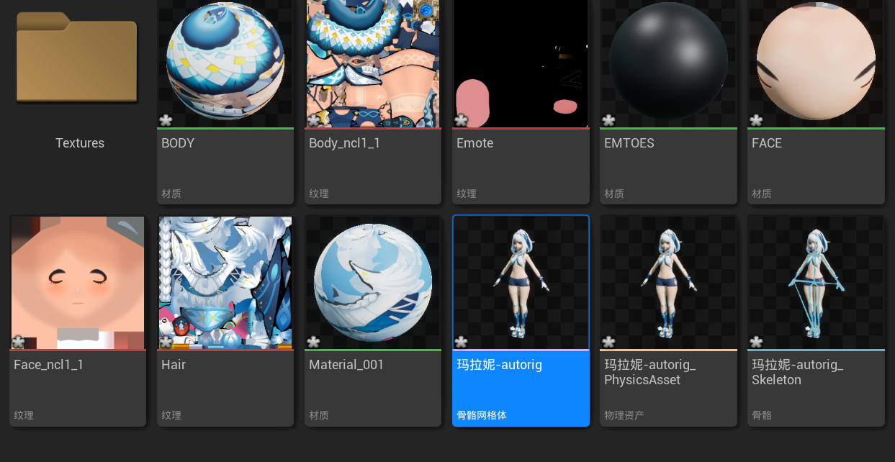

# 骨架网格体

虚幻引擎中角色的基础资产是**骨骼网格体**，这种资产包含角色的一个可视化网格体（即角色的几何模型渲染结果），以及角色的一个包含骨骼数据（用于为角色制作动画）的骨架。

骨骼网格体资产是在外部**数字内容创作（DCC）**软件中创建的，并导出为 .fbx 文件。 然后将FBX文件导入到虚幻引擎项目中。

比如：我们可以通过Blender生成角色和骨骼的.fbx文件，参考教程：https://ue5hub.com/349.html

将角色导入虚幻引擎后，可以在**骨骼网格体编辑器（Skeletal Mesh Editors）**中查看和编辑骨骼网格体资产的组件，例如角色网格体、骨架、物理资产和动画序列属性。

这里要注意的是，尽管骨骼网格体包含角色网格体、骨架、物理资产和动画序列属性等，但是他们都是独立资产。可以将**骨骼网格体**和其他资产（角色网格体、骨架、物理资产、动画序列等）类比为积木的组合：

- **骨骼网格体**可以看作是一个“大的积木”，它由多个独立的“小积木”组成：**可视化网格体**、**骨架**、**物理资产**和**动画序列**。
- 每个“小积木”（独立的资产）可以单独修改、替换或共享。如果你对其中一个“小积木”进行了修改，比如修改了**骨架**或**物理资产**，所有依赖这些资产的**骨骼网格体**都会反映出这些变化。
- 同时，如果你在**骨骼网格体**（“大积木”）中修改了某个组件（例如调整物理属性或修改动画），这些更改也会影响到相关的独立资产。

如上图是导入fbx后的组件，包含了骨骼网格体、物理资产、骨骼、纹理和材质等等。如果有动画的话，还会包含动画信息。

# 角色蓝图

有了资产以后，为了控制骨骼网格体资产（作为角色或其他不可操作角色和对象），必须创建**角色蓝图**并将骨骼网格体添加为网格体组件，以便构建游戏和动画逻辑来管理其行为并组装其部件。**角色蓝图**是虚幻引擎中控制骨骼网格体及其行为的主要工具，可以看作是在骨骼网格体之上的一个更大的“积木”。通过角色蓝图，你可以为角色设置动画、控制逻辑、物理行为等。我们有两种方式去实现**角色蓝图**：

*(以下内容由GPT生成，自己还未手动操作)*

## 1. 创建蓝图：从零开始造轮子

这种方法是指从头开始创建一个角色蓝图，并手动添加骨骼网格体和其他必要组件。适合于想要完全自定义角色控制的情况。

1. **导入骨骼网格体资产**：
   - 使用外部DCC工具（如Blender、Maya）创建角色的**骨骼网格体**并导出为 `.fbx` 文件。
   - 在虚幻引擎中，通过**Content Browser**将 `.fbx` 文件导入项目中。导入后，你将拥有一个包含角色模型和骨骼的骨骼网格体。
2. **创建角色蓝图**：
   - 在**Content Browser**中，右键点击空白处，选择 `Blueprint Class`。
   - 选择**Character**作为基类，这会创建一个带有默认行走和跳跃功能的蓝图类。
   - 给新蓝图命名，例如 `BP_MyCharacter`。
3. **添加骨骼网格体**：
   - 打开新创建的蓝图编辑器。
   - 在**Components**窗口中，点击**Add Component**按钮，选择 `Skeletal Mesh`。
   - 在**Details**面板中，找到**Skeletal Mesh**选项，选择你之前导入的骨骼网格体作为角色的网格体。
4. **配置动画蓝图**（可选）：
   - 如果需要动画控制，你还需要为角色创建一个**动画蓝图**。动画蓝图可以为角色提供行走、跑步等动作逻辑。
   - 在**Content Browser**中右键点击，选择 `Animation Blueprint`。
   - 在动画蓝图中设置角色的各种动画状态，并将它绑定到角色蓝图中的**Skeletal Mesh**组件。
5. **设置角色的控制逻辑**：
   - 使用蓝图编辑器中的**事件图（Event Graph）**，为角色设置逻辑，比如输入响应、移动行为、动画切换等。
   - 通过节点连接不同的输入和事件来实现角色的行为。
6. **保存并测试**：
   - 完成设置后，保存蓝图并将其放置在关卡中。
   - 运行游戏，确保角色的移动、动画和其他逻辑正常工作。

## 2. 修改骨骼IK：替换现有蓝图的骨骼网格体

这是一种更简便的方法，适用于已有角色蓝图的情况，你只需替换其中的骨骼网格体或调整骨骼IK（逆向运动学）以实现新的控制。

1. **选择已有角色蓝图**：
   - 在**Content Browser**中找到一个已有的角色蓝图，例如引擎内置的角色或项目中已有的角色蓝图。
2. **打开角色蓝图**：
   - 双击打开该角色的蓝图编辑器。
3. **替换骨骼网格体**：
   - 在**Components**面板中，找到现有的`Skeletal Mesh`组件。
   - 在**Details**面板中，找到**Skeletal Mesh**选项，并将其更换为你新导入的骨骼网格体。
4. **调整IK设置**（骨骼IK调整是骨骼动画系统中的一种技术，用来让角色在动画中适应物理环境）：
   - 选择蓝图中的**Event Graph**，找到与IK控制相关的蓝图逻辑。
   - 调整IK控制节点，确保新骨骼网格体的骨骼结构适配当前的IK逻辑。
   - 通常包括设置**两足或多足的IK骨骼约束**，例如调整脚的接触点，以确保角色能够根据地形调整脚部位置。
5. **测试骨骼IK**：
   - 在编辑器中拖拽角色到场景中，进行测试。确保角色的动作、骨骼IK响应正确（如在倾斜表面行走时，脚能够正确贴合地面）。
6. **保存并测试**：
   - 保存修改后的蓝图，将其放置到关卡中进行测试。

# 参考资料

官方文档：https://dev.epicgames.com/documentation/zh-cn/unreal-engine/skeletal-mesh-assets-in-unreal-engine
